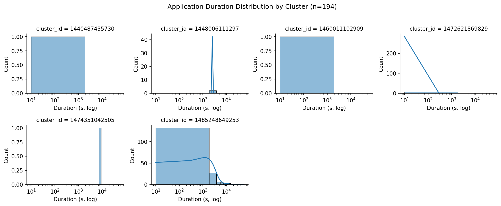

# Problem 1: Log Level Distribution

## Apporach

I used PySpark to analyse the log files stores in the S3 bucket and determine the distribution of different log levels. 

- The python script creates a Spark session connected to the cluster master and read all the log files recurssively. 
- Using regex, I extracted standard log levels (INFO, WARN, ERROR, DEBUG) from each line.   
- Filtered out the lines with the requried log level, adn aggregated the counts for each category.  
- Wrote a random sample of ten log lines to review message types.  
- Generated summary statistics contianing info on total lines processes, lines containing required levels, and distribution of each level.  

## Key findings

| Log Level | Count     |
|------------|-----------:|
| INFO | 27,389,482 |
| WARN | 9,595 |
| ERROR | 11,259 |
| DEBUG | 0 |
 
The log analysis revealed that nearly all cluster log entries were informational, with INFO messages accounting for about 99.9% of all lines containing identifiable log levels. These messages primarily document normal Spark operations such as task execution, data storage in memory, and file output commits to HDFS, indicating smooth job progression. A very small portion of logs were classified as WARN (0.04%) or ERROR (0.04%), suggesting that the cluster experienced only minor or transient issues during execution.

## Spark Web UI

## Application UI

# Problem 2: Cluster Usage Analysis

## Approach 

I used PySpark to process cluster log data stored in the S3 bucket and analyze application usage patterns across clusters.

- The python script creates a Spark session connected to the cluster master and read all the log files recurssively. 
- Extracted key identifiers such as cluster_id, application_id, adn app_number from file paths using regular expressions, and parsed timestamps from log entries.  
- filtered out invalid or empty timestaps and create a timeline dataset that contains the start adn end times of each application.  
- Aggregated per-cluster statistics including the number of applications, the firt and last start times, and average usage metrics.  
- Saved the three outputs for further analysis.  
- Used Seaborn to generate the barchart and density plots.  
- Encountered environment issues where Matplotlib and Seaborn were missing on the cluster nodes; resolved this by installing them within the virtual environment (uv pip install matplotlib seaborn pandas) and using the "Agg" backend to support headless rendering. (Note: Debugged using ChatGPT5).  
- Generated plots direclty from existing outputs using `--skip-spark`.

## Key findings

The bar chart visualization highlights the imbalance with a single dominant cluster handling nearly all workload activity. A total of 194 applications were detected across 6 unique clusters, showing clear variation in workload distribution. Cluster 1485248649253 was by far the most active, running 181 applications accounting for over 93% of all executions. The remaining clusters were used much less frequently: one cluster ran 8 applications, one ran 2, and the rest only 1 each.

The above faceted duration plot reveals that most clusters had only short or isolated runs, while the busiest cluster (1485248649253) showed a broad spread of application durations spanning multiple orders of magnitude (seconds to hours). This pattern suggests that the environment was heavily centralized, with one cluster serving as the main computation node, while others were likely reserved for smaller, test, or transient workloads.

## Spark Web UI

## Application UI

